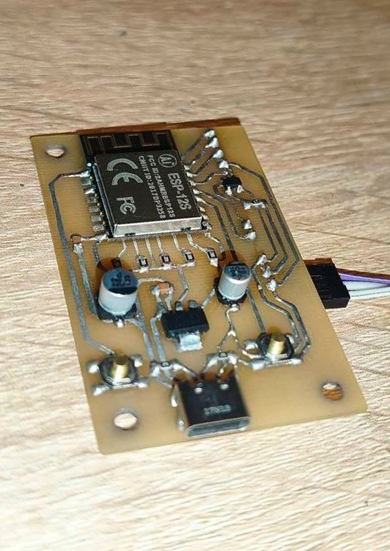
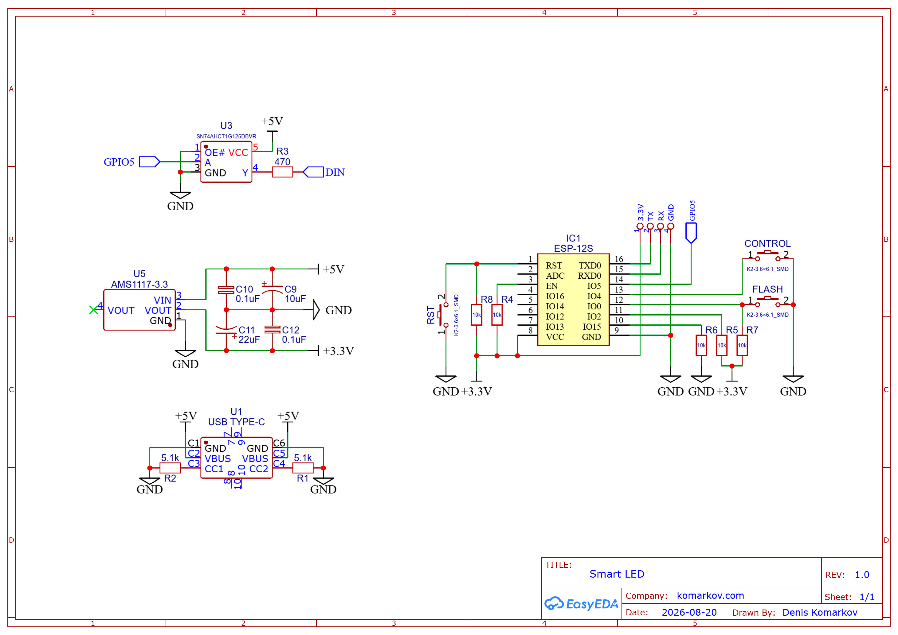
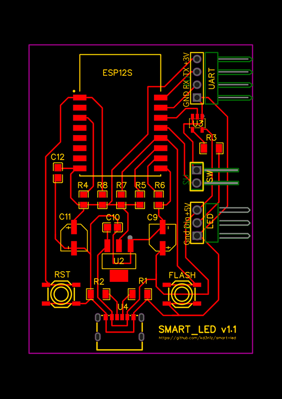

# smart-led

An open-source, ESP12S-based Wi-Fi controller for WS2812B LED strips.



## Features

- **Wi-Fi Connectivity:** Remote control via Web UI or binary HTTP API.
- **Offline Support:** Wi-Fi is completely optional. Basic on/off functionality works without a network, and the Wi-Fi connection routine is non-blocking, keeping the strip fully responsive.
- **Addressable LEDs:** Full support for 5V WS2812B strips.
- **Compact Design:** Custom PCB optimized for the ESP12S module.

## Binary HTTP API

The controller features a highly efficient, lightweight binary API. It accepts raw bytes in the HTTP request body via `POST` to `/api`, allowing you to batch multiple commands in a single request.

**Response Format:**
The server responds with an `application/octet-stream`. It streams the output of any `GET` commands sequentially, always terminating the response with a **1-byte status code** (footer).

### Commands

| Command Byte | Name                 | Arguments (Input)      | Returns (Output)       |
| :----------- | :------------------- | :--------------------- | :--------------------- |
| `0x00`       | `CMD_GET_COLOR`      | _None_                 | 3 bytes `(R, G, B)`    |
| `0x01`       | `CMD_GET_BRIGHTNESS` | _None_                 | 1 byte `(0-255)`       |
| `0x02`       | `CMD_GET_IS_ON`      | _None_                 | 1 byte `(0=Off, 1=On)` |
| `0xFF`       | `CMD_SET_COLOR`      | 3 bytes `(R, G, B)`    | _None_                 |
| `0xFE`       | `CMD_SET_BRIGHTNESS` | 1 byte `(0-255)`       | _None_                 |
| `0xFD`       | `CMD_SET_IS_ON`      | 1 byte `(0=Off, 1=On)` | _None_                 |

### Status Codes (Response Footer)

Every API response strictly ends with one of the following status bytes:

- `0x00` — **OK**: All commands executed successfully.
- `0x01` — **No data**: The request body was empty.
- `0x02` — **Unknown command**: An unrecognized byte was encountered.
- `0x03` — **Not enough arguments**: A command lacked the required payload bytes.

### Client Implementation

The frontend includes a fully typed, object-oriented TypeScript client using the Command pattern. It automatically handles binary encoding/decoding, request batching, and retries.

You can find the full implementation in [`gui/src/lib/api.ts`](./gui/src/lib/api.ts).

**Usage Example:**
Because the API supports batching, you can chain multiple commands into a single request. The client will encode them, send the payload, and parse the returning byte stream back into the command objects.

```typescript
import {
    performRequest,
    SetColorCommand,
    SetIsOnCommand,
    GetColorCommand,
    GetBrightnessCommand,
} from "./api";

// Example 1: Write multiple states in one request
await performRequest([
    new SetColorCommand(255, 0, 0), // Set to Red
    new SetIsOnCommand(true), // Turn on
]);

// Example 2: Read multiple states in one request
const colorCmd = new GetColorCommand();
const brightnessCmd = new GetBrightnessCommand();

await performRequest([colorCmd, brightnessCmd]);

console.log("Current color:", colorCmd.result()); // "#ff0000"
console.log("Current brightness:", brightnessCmd.result()); // 255
```

## Hardware

### Schematics



### PCB



## Usage

- Define your Wi-Fi SSID & password in the [secrets.h](./include/secrets.h):
    ```c
    #ifndef SMART_LED_SECRETS
    #define SMART_LED_SECRETS

    #define WIFI_SSID "SSID"
    #define WIFI_PASSWORD "PASSWORD"

    #endif
    ```
